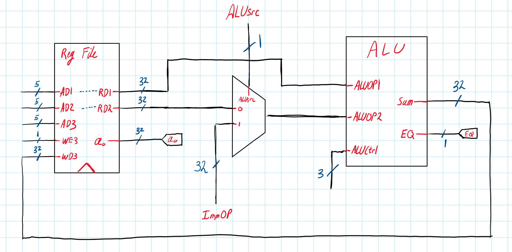
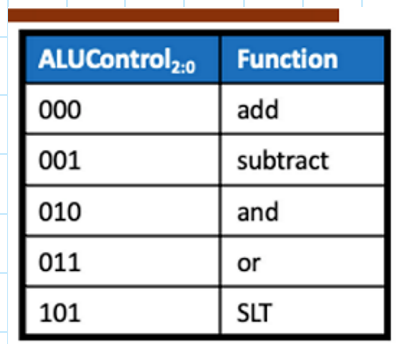

# Task 2, ALU and Register Files

## Diagram of circuit schematic:
This is a diagram of part 2 in lab 4. Shown are the input connections required, the CPU blocks that have been constructed, and the internal connections needed.

## Construction Process:
All the components were constructed seperately, and then combined in a top level SystemVerilog file part2.sv. This file allows the final testbench to interact with this portion of the cpu as one "block", rather than 3 seperate blocks. There is a clocked input, but note that the clocked input is only for the register, where both the read and write ports are clocked, the rest is combinational.

### RegFiles:
The register Files is a standard register file, with 3 ports. The first two ports are for read interactions, where the first address outputs the first data out, and the second address -> seccond data. The third port is exclusively for the write port, where if WEN = 1, on a positive clock edge the data value in WD3 will be stored in the address in port 3. **This will only happen on a positive clock edge**

### ALUMux
This is just a multiplexer that allows either the second read port, or an immidiate value to be used as the second input operand for the ALU. There is really nothing special about it, note that it is asyncronous, while the inputs are techniclly syncronous as they only change on a clock posedge, ALUsrc can be changed asyncronously, and as the ALU is asyncronous this means that the value SUM can be changed asyncronously.

### ALU
The ALU unit can perform five different operations based on the opcode (ALUCtrl). Below are the different opcodes that can be used for the arithmatic 

The two inputs must have the same input data width, as the ALU does not sign extend. The ALU is asyncronous and thus does not have a clocked input SLT sets the output SUM to 1 if op1 > op2, else sets it to 0, EQ is 1 if both the operands equal eachother.

